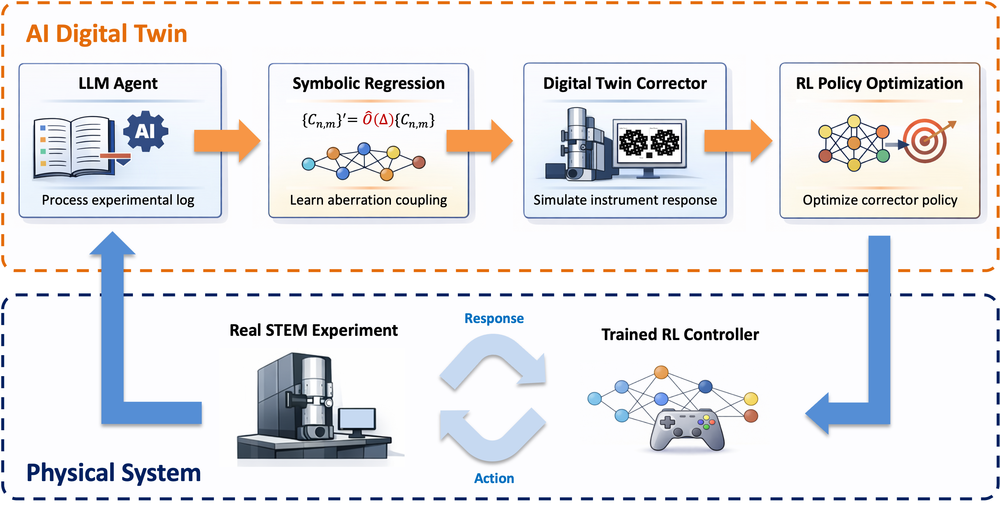

# Interpretable Digital Twins for Autonomous STEM Aberration Correction

This repository contains a proof-of-concept framework for **machine-learning-assisted aberration correction in scanning transmission electron microscopy (STEM)**. The project integrates **LLM-based log parsing, symbolic regression, a corrector digital twin, and reinforcement learning** to enable faster, more stable, and reproducible aberration correction with reduced reliance on expert operators.

## Overview

Achieving sub-ångström resolution in STEM requires precise tuning of lens aberrations. In practice, aberration correction is a nonlinear, strongly coupled, and operator-dependent process: adjusting one aberration coefficient often perturbs multiple others, leading to unstable convergence and repeated trial-and-error tuning.

This project introduces an **interpretable digital twin framework** that learns aberration–response relationships directly from real experimental logs and uses them to autonomously optimize correction strategies.

  

*Figure 1: AI-based digital twin framework integrating LLM-based experimental log parsing, symbolic regression-derived coupling models, a corrector simulator, and reinforcement learning-based optimization in a closed loop with the physical microscope.*

## Framework Components

The framework consists of four tightly coupled modules:

1. **LLM-Based Log Parsing**  
   Human-generated STEM aberration correction logs are automatically parsed and standardized using a large language model. The parser extracts time-ordered aberration coefficients, correction actions, and convergence behavior into structured trajectories suitable for downstream learning.

2. **Symbolic Regression for Aberration Coupling**  
   A sparsity-promoting symbolic regression method (SINDy-style) is applied to the parsed trajectories to identify **nonlinear and cross-coupled response relationships** between corrector settings and aberration evolution. The resulting analytical expressions provide interpretable models of corrector behavior.

3. **Corrector Digital Twin Simulator**  
   A lightweight aberration corrector simulator embeds the learned symbolic response functions. Given an initial aberration state and a correction action, the simulator predicts the updated aberration coefficients, optionally incorporating noise and actuation constraints to mimic experimental conditions.

4. **Reinforcement Learning–Based Optimization**  
   Aberration correction is formulated as a sequential decision-making problem and solved using a Proximal Policy Optimization (PPO) agent. The agent outputs multi-parameter correction actions simultaneously, learning a robust closed-loop policy under cross-coupled dynamics and stochastic disturbances.

## Repository Structure
